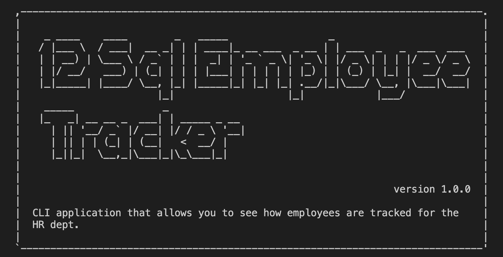
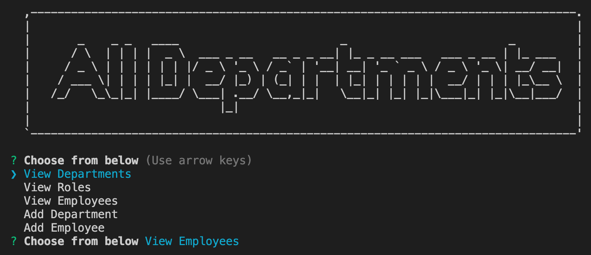
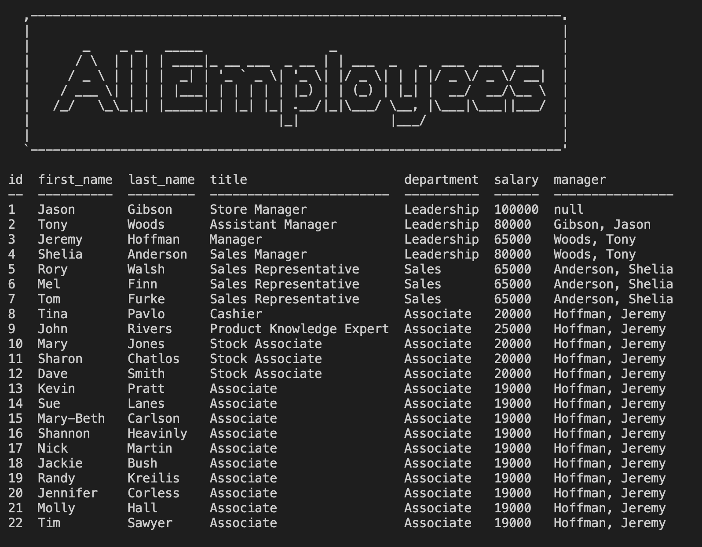
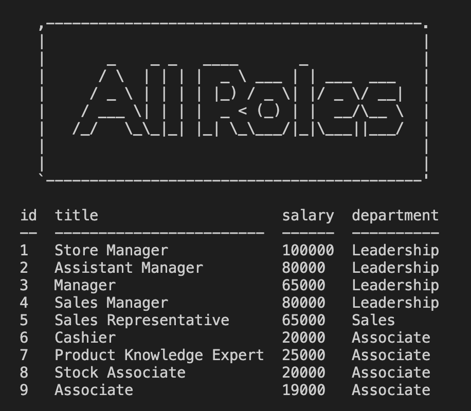
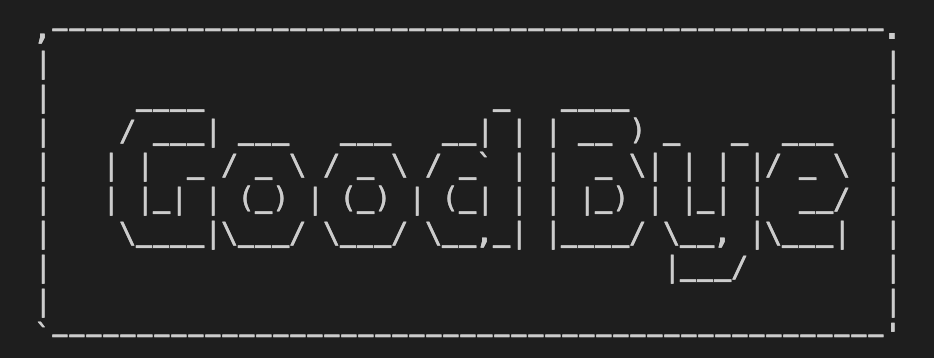

# SQL-Employee-Tracker

This is a cli application that allows you to search through the employee data base, the inqurier prompt makes this an easy interface to work with. The application uses asciiart-logo to draw out the different request the application can make. 

# Table of Contents

|                               |                         |
| ----------------------------- | ----------------------- |
| [GitHub Links](#github-links) | [Questions](#questions) |
| [Installation](#installation) | [License](#license)     |
| [Test](#test)                 | [Credits](#credits)     |
| [Usage](#usage)               |                         |
|                               |                         |

# Installation

Open terminal/gitbash and run the following:

```
  npm install, add in your msql username and password into the index.js file
```

## Usage

To start the CLI please run the following in terminal/gitbash:

```
  node server.js
```

## Here is a preview of README Generator!







# GitHub Links

Project Video [Link](https://drive.google.com/file/d/1gHuiBgL3fyNt1QEs0GtX8wS4EGRbbybM/view?usp=sharing)<br>
Project Repository [Link](https://github.com/jeffcela/12-SQL-Employee-Tracker)

## Questions

Please direct any questions to jeffcela@gmail.com

# Contributing

Please refer to each project's style and contribution guidelines for submitting patches and additions. In general, we follow the "fork-and-pull" Git workflow.

1. Fork the repo on GitHub
2. Clone the project to your own machine
3. Commit changes to your own branch
4. Push your work back up to your fork
5. Submit a Pull request so that we can review your changes

# Credits

_This homework assignment was completed in VS Code and Terminal by Jeff Cela on the day of 09/23/2021_
© 2021 Trilogy Education Services, LLC, a 2U, Inc. brand. Confidential and Proprietary. All Rights Reserved.

# License

[](https://shields.io)
